# HMI Nextion - Interfaces de Usuario

## Descripción General
Este repositorio contiene las interfaces gráficas de usuario diseñadas para el sistema HMI (Human Machine Interface) implementado con pantallas Nextion. Las interfaces fueron desarrolladas específicamente para la aplicación y optimizadas para el hardware de visualización utilizado.

## Especificaciones Técnicas

### Herramientas de Desarrollo
- **Diseño de Interfaces**: Canvas (creación propia)
- **Recursos Gráficos**: Flavicon (apoyo en iconografía)
- **Plataforma Destino**: Pantallas Nextion
- **Total de Assets**: 13 interfaces/imágenes

### Características de las Interfaces
- Diseño original y personalizado
- Optimizadas para pantallas Nextion
- Integración de iconografía profesional
- Interfaz intuitiva y funcional
- Compatibilidad con el hardware específico

## Documentación de Interfaces

### Interfaz 1: Pantalla Principal de Control

#### Descripción General
La interfaz principal funciona como centro de control del sistema, permitiendo la gestión del estado de energía y navegación entre los diferentes módulos operativos.

#### Estados de la Interfaz

**Estado 1: Sistema Apagado**
- **Archivo**: `1.png`
- **Descripción**: Estado inicial al energizar la pantalla
- **Elementos Visuales**:
  - Logo institucional "UNIVERSIDAD ECC CT"
  - Botón "Off" activo en color rojo
  - Icono de menú principal en color rojo
  - Botón "On" en estado inactivo
- **Comportamiento**:
  - Sistema en estado de reposo
  - Solo disponible la opción de encendido

**Estado 2: Sistema Encendido - Menú Principal**
- **Archivo**: `2.png`
- **Descripción**: Estado activo del sistema con menú de navegación desplegado
- **Elementos Visuales**:
  - Botón "On" activo en color verde
  - Icono de menú principal en color verde
  - Botón "Off" desactivado
  - Menú de opciones disponible:
    - CALIBRACION HOME
    - AUTOMATICO
    - DIAGNOSTICO
    - OPERACION MANUAL
    - ALERTA
- **Comportamiento**:
  - Sistema operativo y listo para recibir comandos
  - Navegación habilitada entre los 5 módulos

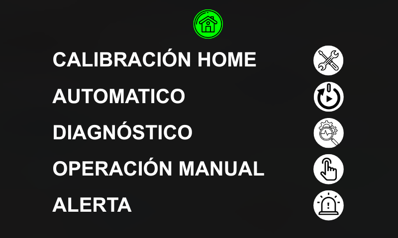

**Estado 3: Navegación Activa con Indicador STOP**
- **Archivo**: `3.png`
- **Descripción**: Estado de navegación con botón seleccionado y sistema en STOP
- **Elementos Visuales**:
  - Botón de navegación seleccionado en color amarillo
  - Indicador "STOP" visible en la esquina superior derecha
  - Resto de botones en estado normal
  - Botón "On" mantiene estado activo verde
- **Comportamiento**:
  - Visualización del módulo actualmente seleccionado
  - Indicación clara del estado de seguridad "STOP"
  - Navegación entre módulos manteniendo el estado del sistema

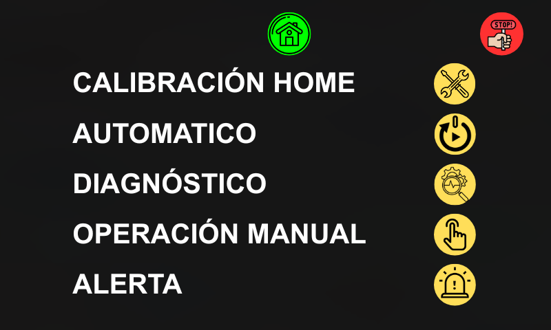

#### Funcionalidades Principales
1. **Control de Energía**: Encendido/Apagado del sistema
2. **Navegación Modular**: Acceso a los 5 módulos operativos
3. **Indicación de Estado**: Feedback visual inmediato del estado del sistema
4. **Seguridad**: Indicador visible de condición "STOP"

#### Flujo de Navegación
1. **Inicio** → Estado 1 (Sistema Apagado)
2. **Encendido** → Estado 2 (Menú Principal)
3. **Selección de Módulo** → Estado 3 (Navegación Activa)
4. **Condición STOP** → Estado 3 con indicador activo

---
### Interfaz 2: Calibración Home

#### Descripción General
Interfaz especializada para la calibración del sistema Home, permite configurar parámetros de posición y seguridad para el correcto funcionamiento del equipo.

#### Estados de la Interfaz

**Estado 1: Configuración Inicial**
- **Archivo**: `4.png`
- **Descripción**: Estado inicial de configuración de parámetros
- **Elementos Visuales**:
  - Título "CALIBRACIÓN HOME"
  - Campos de distancia para ejes X, Y, Z (en mm)
  - Parámetros "Debounce" y "Separación"
  - Botón "GUARDAR" y "RESET"
  - Botón de herramientas (HOME) en estado normal
- **Comportamiento**:
  - Campos editables para ingreso de valores
  - Botón de herramientas disponible para iniciar calibración
  - Navegación restringida hasta completar el proceso

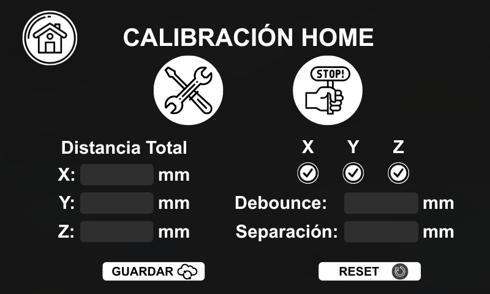

**Estado 2: Calibración Activa con STOP**
- **Archivo**: `5.png`
- **Descripción**: Estado durante proceso de calibración con opción de emergencia
- **Elementos Visuales**:
  - Indicador "STOP!" prominente
  - Botón de herramientas activo en color verde
  - Botón "STOP" en color rojo
  - Botón "RESET" en color amarillo cuando está presionado
  - Valores de distancia y parámetros visibles
- **Comportamiento**:
  - Calibración en progreso (botón herramientas verde)
  - Botón "STOP" disponible para interrupción de emergencia
  - Botón "RESET" para restablecimiento del sistema
  - Navegación bloqueada durante calibración

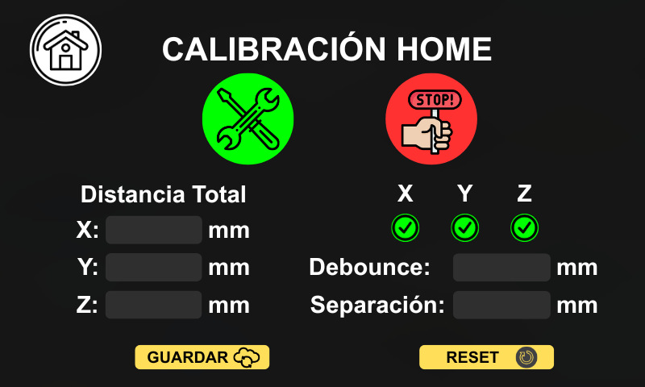

#### Parámetros Configurables
- **Distancias de Ejes**:
  - X: [valor] mm
  - Y: [valor] mm  
  - Z: [valor] mm
- **Parámetros de Seguridad**:
  - Debounce: [valor] mm
  - Separación: [valor] mm

#### Funcionalidades Principales
1. **Configuración de Posición**: Ajuste fino de distancias en ejes X, Y, Z
2. **Inicio de Calibración**: Activación mediante botón de herramientas
3. **Parada de Emergencia**: Interrupción inmediata con botón STOP
4. **Restablecimiento**: Recuperación del sistema con botón RESET
5. **Persistencia de Datos**: Guardado de configuración

#### Flujo Operativo
1. **Ingreso de Parámetros** → Estado 1 (Configuración)
2. **Inicio Calibración** → Estado 2 (Proceso Activo)
3. **Interrupción STOP** → Estado 2 con STOP activo
4. **Restablecimiento RESET** → Retorno a Estado 1

#### Indicadores de Estado
- **🟢 Verde**: Calibración en progreso (botón herramientas)
- **🔴 Rojo**: Sistema detenido (botón STOP)
- **🟡 Amarillo**: Reset temporalmente activado
- **⚪ Normal**: Estado listo para operar

---

### Interfaz 3: Modo Automático

#### Descripción General
Interfaz para la ejecución de rutinas automatizadas del sistema, permitiendo seleccionar y controlar diferentes secuencias operativas predefinidas.

#### Estados de la Interfaz

**Estado 1: Selección de Rutina**
- **Archivo**: `6.png`
- **Descripción**: Estado inicial para selección de rutinas automatizadas
- **Elementos Visuales**:
  - Título "AUTOMATICO"
  - Botones "Rutina 1" y "Rutina 2" en estado normal
  - Botón "RESET" disponible
  - Sin indicador STOP visible
- **Comportamiento**:
  - Selección exclusiva de una rutina (Rutina 1 o Rutina 2)
  - Botón RESET disponible para restablecimiento
  - Navegación habilitada entre rutinas

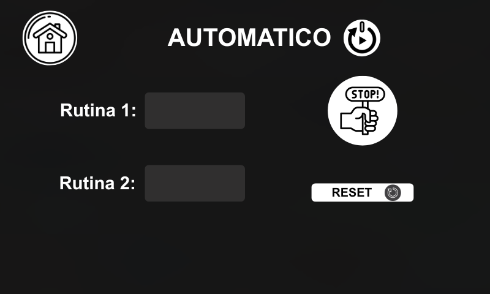

**Estado 2: Ejecución con Interrupción**
- **Archivo**: `7.png`
- **Descripción**: Estado durante ejecución de rutina con capacidad de interrupción
- **Elementos Visuales**:
  - Botón de rutina seleccionada en color verde
  - Indicador "STOP!" prominente en color rojo
  - Botón "RESET" en color amarillo cuando está presionado
  - Rutina no seleccionada en estado normal
- **Comportamiento**:
  - Rutina en ejecución (botón en verde)
  - Botón STOP disponible para interrupción inmediata
  - Botón RESET para restablecimiento del sistema
  - Comandos bloqueados durante estado STOP

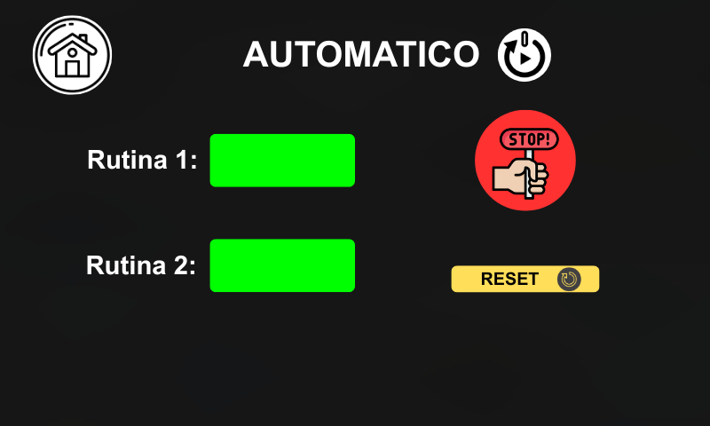

#### Funcionalidades Principales
1. **Selección de Rutinas**: Elección entre Rutina 1 y Rutina 2 (exclusiva)
2. **Ejecución Automatizada**: Puesta en marcha de secuencia seleccionada
3. **Interrupción de Emergencia**: Parada inmediata con botón STOP
4. **Restablecimiento**: Recuperación del sistema con botón RESET

#### Flujo Operativo
1. **Selección de Rutina** → Estado 1 (Selección)
2. **Inicio Ejecución** → Estado 2 (Rutina Activa en verde)
3. **Interrupción STOP** → Estado 2 con STOP activo (rojo)
4. **Restablecimiento RESET** → Retorno a Estado 1

#### Comportamiento con Sistema en STOP
- **🔴 Botón STOP en rojo**: Indica parada de emergencia activa
- **🟡 Botón RESET en amarillo**: Indica restablecimiento temporal activo
- **⚪ Botones de rutina en color inicial**: Rutinas desactivadas durante STOP
- **Bloqueo de comandos**: Solo RESET disponible durante estado STOP

#### Reglas de Operación
- **Selección Exclusiva**: Solo una rutina puede estar activa simultáneamente
- **Secuencia de Control**: STOP debe preceder a RESET
- **Bloqueo de Comandos**: En estado STOP, solo RESET está habilitado
- **Feedback Visual**: Cambios de color indican estado del sistema

#### Indicadores de Estado
- **🟢 Verde**: Rutina en ejecución
- **🔴 Rojo**: Sistema detenido (STOP activo)
- **🟡 Amarillo**: Reset temporalmente activado
- **⚪ Normal**: Rutina disponible para selección

---

### Interfaz 4: Diagnóstico del Sistema

#### Descripción General
Interfaz de monitoreo en tiempo real que muestra el estado actual de los sensores y parámetros operativos del sistema. Esta pantalla funciona exclusivamente como visualización de datos recibidos desde la ESP32.

#### Estados de la Interfaz

**Estado 1: Sensores Inactivos**
- **Archivo**: `8.png`
- **Descripción**: Estado inicial con sensores de posición desactivados
- **Elementos Visuales**:
  - Título "DIAGNÓSTICO"
  - Sección de temperaturas por eje (X, Y, Z) en °C
  - Velocidad del usillo en RPM
  - Sensores de posición (Eje X, Y, Z) en estado inactivo
  - Indicadores de sensor en color normal/desactivado
- **Comportamiento**:
  - Visualización de datos en tiempo real
  - Solo recepción de datos desde ESP32
  - Sin capacidad de envío de comandos

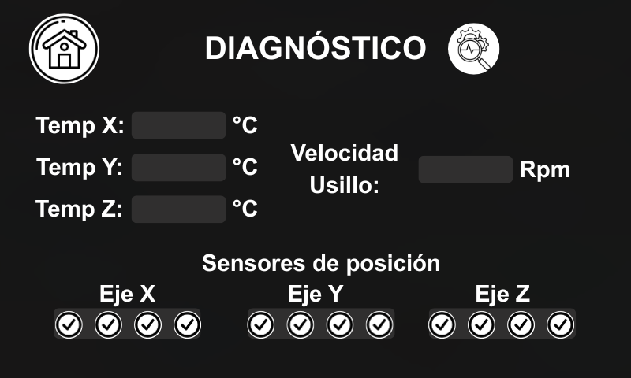

**Estado 2: Sensores Activos**
- **Archivo**: `9.png`
- **Descripción**: Estado con sensores de posición activados y verificados
- **Elementos Visuales**:
  - Título "DIAGNÓSTICO"
  - Sección de temperaturas por eje (X, Y, Z) en °C
  - Velocidad del usillo en RPM con formato destacado
  - Sensores de posición con indicadores de verificación (✅)
  - Tabla organizada para ejes X, Y, Z
- **Comportamiento**:
  - Visualización de estados activos de sensores
  - Feedback visual inmediato de cambios de estado
  - Monitoreo continuo sin interacción del usuario

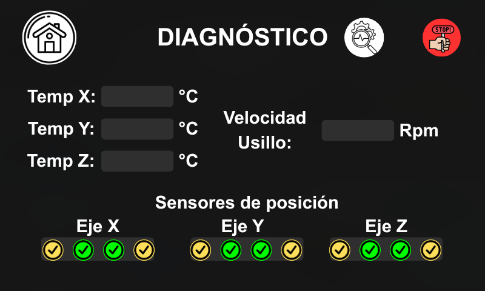

#### Parámetros Monitoreados
- **Temperaturas del Sistema**:
  - Temp X: [valor] °C
  - Temp Y: [valor] °C
  - Temp Z: [valor] °C
- **Velocidad Operativa**:
  - Usillo: [valor] RPM
- **Estado de Sensores de Posición**:
  - Eje X: Inactivo/Activo ✅
  - Eje Y: Inactivo/Activo ✅
  - Eje Z: Inactivo/Activo ✅

#### Funcionalidades Principales
1. **Monitoreo de Temperatura**: Seguimiento en tiempo real de temperaturas por eje
2. **Control de Velocidad**: Visualización de RPM del usillo
3. **Estado de Sensores**: Indicación visual de activación/desactivación
4. **Recepción de Datos**: Comunicación unidireccional desde ESP32

#### Características de Comunicación
- **🔻 Solo Recepción**: La interfaz exclusivamente recibe datos
- **📊 Actualización en Tiempo Real**: Datos refrescados continuamente
- **🚫 Sin Interacción**: No envía comandos al sistema
- **👁️ Visualización**: Propósito exclusivo de monitoreo

#### Indicadores de Estado
- **✅ Verde**: Sensor de posición activo
- **⚪ Normal/Desactivado**: Sensor de posición inactivo
- **📋 Tabla Organizada**: Presentación estructurada de estados

#### Flujo de Datos
1. **ESP32 → HMI**: Envío continuo de datos de sensores
2. **HMI → Visualización**: Actualización de indicadores en pantalla
3. **Cambio de Estado**: Transición entre Estados 1 y 2 según datos recibidos

---

### Interfaz 5: Operación Manual

#### Descripción General
Interfaz para control manual de los ejes del sistema, permitiendo ajustes incrementales de posición mediante comandos JOG con control de velocidad personalizable.

#### Estados de la Interfaz

**Estado 1: Operación Normal**
- **Archivo**: `10.png`
- **Descripción**: Estado operativo para control manual de ejes
- **Elementos Visuales**:
  - Título "OPERACIÓN MANUAL"
  - Campo "Velocidad JOG" en Hertz para configuración
  - Coordenadas actuales para ejes X, Y, Z (en mm)
  - Botones "+" y "-" para cada eje
  - Botones STOP y RESET en estado normal
- **Comportamiento**:
  - Configuración de velocidad JOG mediante entrada numérica
  - Control incremental/decremental de posición por eje
  - Visualización en tiempo real de coordenadas
  - Navegación completa habilitada

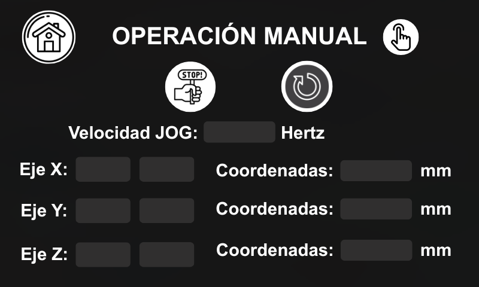

**Estado 2: Sistema en STOP**
- **Archivo**: `11.png`
- **Descripción**: Estado de interrupción con parada de emergencia activa
- **Elementos Visuales**:
  - Indicador "STOP!" prominente en color rojo
  - Velocidad JOG mostrada en mm/min
  - Coordenadas actuales para ejes X, Y, Z (en mm)
  - Botón STOP en color rojo activo
  - Botón RESET en color amarillo cuando está presionado
- **Comportamiento**:
  - Comandos JOG bloqueados durante estado STOP
  - Solo botón RESET habilitado para restablecimiento
  - Visualización de coordenadas mantiene valores actuales
  - Velocidad JOG convertida a mm/min para referencia

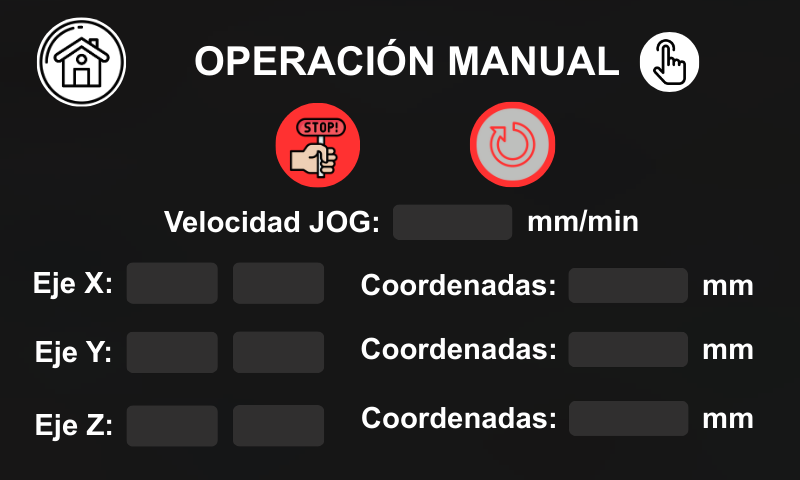

#### Parámetros Configurables
- **Velocidad JOG**: [valor] Hertz (configuración de incremento)
- **Coordenadas Actuales**:
  - Eje X: [valor] mm
  - Eje Y: [valor] mm
  - Eje Z: [valor] mm

#### Funcionalidades Principales
1. **Control de Velocidad JOG**: Configuración del incremento/decremento por paso
2. **Movimiento por Eje**: Control independiente para ejes X, Y, Z
3. **Incremento/Decremento**: Botones "+" y "-" para cada eje
4. **Parada de Emergencia**: Interrupción inmediata con botón STOP
5. **Restablecimiento**: Recuperación del sistema con botón RESET

#### Control de Movimiento por Eje
- **Eje X**: 
  - ➕ Botón "+": Incrementa coordenada según valor JOG
  - ➖ Botón "-": Decrementa coordenada según valor JOG
- **Eje Y**:
  - ➕ Botón "+": Incrementa coordenada según valor JOG
  - ➖ Botón "-": Decrementa coordenada según valor JOG
- **Eje Z**:
  - ➕ Botón "+": Incrementa coordenada según valor JOG
  - ➖ Botón "-": Decrementa coordenada según valor JOG

#### Flujo Operativo
1. **Configuración JOG** → Ingreso de valor de velocidad
2. **Control Manual** → Pulsación de botones +/- por eje
3. **Interrupción STOP** → Estado 2 con comandos bloqueados
4. **Restablecimiento RESET** → Retorno a Estado 1

#### Comportamiento con Sistema en STOP
- **🔴 Botón STOP en rojo**: Indica parada de emergencia activa
- **🟡 Botón RESET en amarillo**: Indica restablecimiento temporal activo
- **🚫 Botones JOG bloqueados**: Comandos +/- deshabilitados durante STOP
- **📊 Coordenadas visibles**: Valores actuales mantienen visualización

#### Conversión de Unidades
- **Configuración**: Hertz → Define frecuencia de incremento
- **Visualización STOP**: mm/min → Velocidad lineal de referencia
- **Coordenadas**: mm → Unidad estándar de posición

#### Indicadores de Estado
- **🟢 Operativo**: Sistema listo para control manual
- **🔴 STOP**: Parada de emergencia activa (comandos bloqueados)
- **🟡 RESET**: Restablecimiento temporal en proceso
- **⚪ Normal**: Estado inicial listo para operar

---

### Interfaz 6: Panel de Alertas
*(Descripción pendiente)*

### Interfaz 7: Configuración Avanzada
*(Descripción pendiente)*

### Interfaz 8: Monitoreo en Tiempo Real
*(Descripción pendiente)*

### Interfaz 9: Histórico de Eventos
*(Descripción pendiente)*

### Interfaz 10: Ajustes de Parámetros
*(Descripción pendiente)*
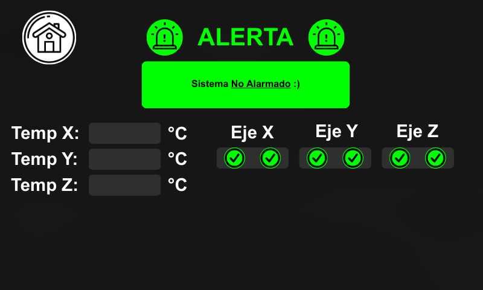

### Interfaz 11: Estado del Sistema
*(Descripción pendiente)*
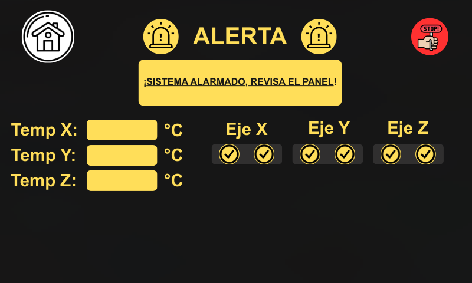

### Interfaz 12: Configuración de Red
*(Descripción pendiente)*

### Interfaz 13: Acerca del Sistema
*(Descripción pendiente)*

## Estructura de Archivos

from machine import I2C, Pin, UART, ADC
import time
import json

# Configuración I2C como maestro
I2C_MASTER_SDA = 21
I2C_MASTER_SCL = 22
I2C_SLAVE_ADDRESS = 0x08
I2C_FREQ = 100000

current_page = -1

# Configuración Nextion
NEXTION_UART_PORT = 2
NEXTION_TX = 17
NEXTION_RX = 16
NEXTION_BAUDRATE = 9600

# ========== CONFIGURACIÓN SENSORES PT100 ==========
adc_pt100_1 = ADC(Pin(32))
adc_pt100_2 = ADC(Pin(33))

# Configurar ADC para máximo rango (0-3.3V)
adc_pt100_1.atten(ADC.ATTN_11DB)  # Rango completo 0-3.3V
adc_pt100_2.atten(ADC.ATTN_11DB)
adc_pt100_1.width(ADC.WIDTH_12BIT)  # 12 bits (0-4095)
adc_pt100_2.width(ADC.WIDTH_12BIT)

# Parámetros de conversión (TRANSMISOR 4-20mA)
RESISTOR_SHUNT = 165.0      # Resistor de 165Ω
RANGE_MIN_MA = 4.0          # 4mA = 0°C
RANGE_MAX_MA = 20.0         # 20mA = 200°C  
TEMP_MIN = 0.0              # Temperatura mínima
TEMP_MAX = 200.0            # Temperatura máxima

# Variables globales
i2c = None
nextion = None
slave_connected = False
ultimo_comando_esclavo = ""

# Estados de los sensores
sensor_states = {
    'x_h0': 'off',
    'x_hf': 'off', 
    'y_h0': 'off',
    'y_hf': 'off',
    'z_h0': 'off',
    'z_hf': 'off'
}

# Variables para temperaturas
temperatura_pt100_1 = 0.0
temperatura_pt100_2 = 0.0

# ========== INICIALIZACIÓN ==========

def init_i2c_master():
    global i2c
    try:
        i2c = I2C(0, scl=Pin(I2C_MASTER_SCL), sda=Pin(I2C_MASTER_SDA), freq=I2C_FREQ)
       
        # Escanear una sola vez al inicio
        devices = i2c.scan()
        if devices:
            print("Dispositivos I2C encontrados:", [hex(device) for device in devices])
            if I2C_SLAVE_ADDRESS in devices:
                print("Esclavo I2C conectado")
                return True
            else:
                print("Esclavo I2C NO encontrado")
                return False
        return False
    except Exception as e:
        print("Error inicializando I2C maestro:", e)
        return False

def init_nextion():
    global nextion
    try:
        nextion = UART(NEXTION_UART_PORT, baudrate=NEXTION_BAUDRATE, tx=Pin(NEXTION_TX), rx=Pin(NEXTION_RX))
        print("Nextion inicializado")
        return True
    except Exception as e:
        print("Error inicializando Nextion:", e)
        return False

# ========== FUNCIONES NEXTION ==========

def send_nextion_command(cmd):
    global nextion
    try:
        full_cmd = cmd.encode() + b'\xFF\xFF\xFF'
        nextion.write(full_cmd)
        print("Comando Nextion enviado:", cmd)
        return True
    except Exception as e:
        print("Error enviando comando Nextion:", e)
        return False

def drain_until_idle(quiet_ms=60):
    global nextion
    t = time.ticks_ms()
    while True:
        while nextion.any() > 0:
            nextion.read(1)
            t = time.ticks_ms()
        if time.ticks_diff(time.ticks_ms(), t) > quiet_ms:
            break
        time.sleep_ms(1)

# Agrega esta variable global al inicio con las otras variables

# ========== FUNCIONES NEXTION ==========

def read_nextion():
    global nextion, current_page  # Agregar current_page aquí
    
    static_in66 = False
    static_page_tmp = -1
    static_ff_count = 0
    static_in_line = False
    static_line = ""
    
    while nextion.any() > 0:
        b = nextion.read(1)[0]
        
        # Trama 0x66 <page> FF FF FF
        if not static_in66:
            if b == 0x66:
                static_in66 = True
                static_page_tmp = -1
                static_ff_count = 0
                continue
        else:
            if static_page_tmp < 0:
                static_page_tmp = b
                continue
                
            if b == 0xFF:
                static_ff_count += 1
                if static_ff_count == 3:
                    print(f"Cambio de página: {static_page_tmp}")
                    current_page = static_page_tmp  # ACTUALIZAR VARIABLE GLOBAL
                    static_in66 = False
                    static_ff_count = 0
                    continue
            else:
                static_ff_count = 0
            continue
        
        # Procesar líneas de texto
        if not static_in_line:
            if 32 <= b <= 126:
                static_in_line = True
                static_line = chr(b)
        else:
            if b == 0xFF or b == 0x00 or b == ord('\n') or b == ord('\r'):
                if len(static_line) > 0:
                    print(f"Línea recibida: {static_line}")
                    result = static_line
                    static_line = ""
                    static_in_line = False
                    return result
            elif 32 <= b <= 126:
                static_line += chr(b)
                if len(static_line) > 64:
                    static_line = ""
                    static_in_line = False
    
    return None

# ========== FUNCIONES TEMPERATURA PT100 ==========

def actualizar_temperaturas_nextion():
    global temperatura_pt100_1, temperatura_pt100_2, current_page
    
    try:
        if current_page == 3:
            # Página 3 - Monitoreo de Temperaturas
            send_nextion_command('TempX.txt="{:.1f}"'.format(temperatura_pt100_1))
            send_nextion_command('TempY.txt="{:.1f}"'.format(temperatura_pt100_2))
            
    except Exception as e:
        print("Error actualizando temperaturas en Nextion:", e)
# ========== FUNCIONES I2C ==========

def send_i2c_command(command):
    global i2c, ultimo_comando_esclavo
    
    try:
        cmd_bytes = command.encode('utf-8')
        i2c.writeto(I2C_SLAVE_ADDRESS, cmd_bytes)
        print("Comando enviado:", command)
        
        time.sleep_ms(50)
        
        # Leer respuesta (hasta 256 bytes)
        response = i2c.readfrom(I2C_SLAVE_ADDRESS, 256)
        
        # Convertir a string y encontrar terminador nulo
        response_str = ""
        for byte in response:
            if byte == 0:
                break
            response_str += chr(byte)
        
        print("Respuesta recibida:", response_str)
        
        # LIMPIAR BUFFER I2C - Leer cualquier dato sobrante
        try:
            i2c.readfrom(I2C_SLAVE_ADDRESS, 256)  # Limpiar buffer
        except:
            pass  # No hay más datos
        
        return response_str
        
    except Exception as e:
        error_msg = "ERROR:I2C - " + str(e)
        print(error_msg)
        return error_msg
    
def escuchar_esclavo():
    global i2c, ultimo_comando_esclavo
    
    try:
        try:
            response = i2c.readfrom(I2C_SLAVE_ADDRESS, 256)
            
            response_str = ""
            for byte in response:
                if byte == 0:
                    break
                response_str += chr(byte)
            
            if response_str and response_str.strip():
                if response_str != ultimo_comando_esclavo:
                    print(f"Comando espontáneo del esclavo: {response_str}")
                    
                    if not response_str.startswith(('OK:', 'POS:', 'STAT:', 'ERROR')):
                        procesar_comando_esclavo(response_str)
                    
                    ultimo_comando_esclavo = response_str
                
        except:
            pass
            
    except Exception as e:
        print("Error escuchando esclavo:", e)

# ========== FUNCIONES SENSORES ==========

def procesar_comando_esclavo(comando):
    global sensor_states
    
    try:
        comando = comando.strip()
        if not comando:
            return
            
        partes = comando.split()
        if len(partes) < 2:
            return
            
        sensor = partes[0].lower()
        estado = partes[1].lower()
        
        print(f"Comando esclavo recibido: {sensor} -> {estado}")
        
        if sensor in sensor_states:
            sensor_states[sensor] = estado
            actualizar_sensor_nextion(sensor, estado)
            print(f"Sensor {sensor} actualizado a: {estado}")
        else:
            print(f"Sensor no reconocido: {sensor}")
            
    except Exception as e:
        print("Error procesando comando del esclavo:", e)

def actualizar_sensor_nextion(sensor, estado):
    mapa_sensores = {
        'x_h0': 'IzqMedX',
        'x_hf': 'DerMedX',
        'y_h0': 'IzqMedY',
        'y_hf': 'DerMedY',
        'z_h0': 'IzqMedZ',
        'z_hf': 'DerMedZ'
    }
    
    mapa_estados = {
        'on': '15',
        'off': '16'
    }
    
    if sensor in mapa_sensores and estado in mapa_estados:
        obj_name = mapa_sensores[sensor]
        picc_code = mapa_estados[estado]
        send_nextion_command(f'{obj_name}.picc={picc_code}')
        print(f"Actualizado {obj_name} a estado: {estado} (picc={picc_code})")

# ========== FUNCIONES TEMPERATURA PT100 ==========

def leer_temperatura_pt100(adc_sensor):
    try:
        adc_value = adc_sensor.read()
        voltage = (adc_value / 4095.0) * 3.3
        current_ma = (voltage / RESISTOR_SHUNT) * 1000.0
        current_ma = max(RANGE_MIN_MA, min(RANGE_MAX_MA, current_ma))
        temperatura = TEMP_MIN + ((current_ma - RANGE_MIN_MA) * 
                                 (TEMP_MAX - TEMP_MIN) / 
                                 (RANGE_MAX_MA - RANGE_MIN_MA))
        
        return temperatura, adc_value, voltage, current_ma
        
    except Exception as e:
        print("Error leyendo sensor PT100:", e)
        return 0.0, 0, 0.0, 0.0

def actualizar_temperaturas():
    global temperatura_pt100_1, temperatura_pt100_2
    
    try:
        temp1, adc1, volt1, current1 = leer_temperatura_pt100(adc_pt100_1)
        temperatura_pt100_1 = temp1
        
        temp2, adc2, volt2, current2 = leer_temperatura_pt100(adc_pt100_2)
        temperatura_pt100_2 = temp2
        
        #print(f"Temperaturas - PT100-1: {temp1:.1f}°C, PT100-2: {temp2:.1f}°C")
        actualizar_temperaturas_nextion()
        
    except Exception as e:
        print("Error actualizando temperaturas:", e)

# ========== FUNCIONES CONFIGURACIÓN CNC ==========

def set_x_mm(mm):
    cmd = f"SET_X_MM {mm}"
    return send_i2c_command(cmd)

def set_y_mm(mm):
    cmd = f"SET_Y_MM {mm}"
    return send_i2c_command(cmd)

def set_z_mm(mm):
    cmd = f"SET_Z_MM {mm}"
    return send_i2c_command(cmd)

def set_debounce(debounce_ms):
    cmd = f"SET_DEBOUNCE {debounce_ms}"
    return send_i2c_command(cmd)

def set_home_offset(offset_mm):
    cmd = f"SET_HOME_OFFSET {offset_mm}"
    return send_i2c_command(cmd)

def set_time_acel_decel(time_ms):
    cmd = f"SET_TIMEACELYDECEL {time_ms}"
    return send_i2c_command(cmd)

# ========== COMANDOS CNC BÁSICOS ==========

def stop():
    return send_i2c_command("STOP")

def home():
    return send_i2c_command("HOME")

def reset():
    return send_i2c_command("RESET")

def run_cnc():
    return send_i2c_command("RUNCNC")

def start_jog(eje, direccion, velocidad=5000):
    dir_code = 1 if direccion.upper() in ['+', 'POS', '1', 'FORWARD'] else 0
    cmd = "START_JOG {} {} {}".format(eje.upper(), dir_code, velocidad)
    return send_i2c_command(cmd)

def stop_jog():
    return send_i2c_command("STOP_JOG")

def get_position():
    return send_i2c_command("GET_POSITION")

def get_stat():
    return send_i2c_command("GET_STAT")

def get_dimensions():
    return send_i2c_command("GET_DIMENSIONS")

def send_gcode(gcode):
    return send_i2c_command(gcode)

def ping():
    return send_i2c_command("PING")

def get_temperatures():
    return "TEMP1:{:.1f}:TEMP2:{:.1f}".format(temperatura_pt100_1, temperatura_pt100_2)

# ========== FUNCIONES MOVIMIENTO AVANZADO ==========

def mover_a_posicion(x=None, y=None, z=None, velocidad=3000):
    cmd = "G90"
    send_i2c_command(cmd)
    
    move_cmd = "G1"
    if x is not None:
        move_cmd += " X{:.2f}".format(x)
    if y is not None:
        move_cmd += " Y{:.2f}".format(y)
    if z is not None:
        move_cmd += " Z{:.2f}".format(z)
    
    move_cmd += " F{}".format(velocidad)
    return send_i2c_command(move_cmd)

def mover_relativo(dx=0, dy=0, dz=0, velocidad=3000):
    cmd = "G91"
    send_i2c_command(cmd)
    
    move_cmd = "G1"
    if dx != 0:
        move_cmd += " X{:.2f}".format(dx)
    if dy != 0:
        move_cmd += " Y{:.2f}".format(dy)
    if dz != 0:
        move_cmd += " Z{:.2f}".format(dz)
    
    move_cmd += " F{}".format(velocidad)
    return send_i2c_command(move_cmd)

def volver_a_origen():
    return send_i2c_command("G28")

# ========== PROCESAMIENTO COMANDOS NEXTION ==========

def procesar_comando_nextion(comando):
    try:
        comando = comando.strip()
        if not comando:
            return
            
        partes = comando.split()
        if not partes:
            return
        
        cmd = partes[0].upper()
        params = partes[1:] if len(partes) > 1 else []
        
        print("Procesando comando Nextion:", cmd, params)
        
        # ========== COMANDOS DE CONFIGURACIÓN CON ESPACIOS ==========
        if cmd == "DISTX" and params:
            # Formato: "DistX 200" (con espacio)
            try:
                valor = int(params[0])
                print(f"Configurando Distancia X: {valor}")
                result = set_x_mm(valor)
                send_nextion_command(f't3.txt="DistX: {valor} OK"')
                print(f"DistX configurado: {result}")
            except ValueError as e:
                print(f"Error en DistX: {e}")
                send_nextion_command('t3.txt="ERROR: DistX inválido"')
                
        elif cmd == "DISTY" and params:
            # Formato: "DistY 200" (con espacio)
            try:
                valor = int(params[0])
                print(f"Configurando Distancia Y: {valor}")
                result = set_y_mm(valor)
                send_nextion_command(f't3.txt="DistY: {valor} OK"')
                print(f"DistY configurado: {result}")
            except ValueError as e:
                print(f"Error en DistY: {e}")
                send_nextion_command('t3.txt="ERROR: DistY inválido"')
                
        elif cmd == "DISTZ" and params:
            # Formato: "DistZ 200" (con espacio)
            try:
                valor = int(params[0])
                print(f"Configurando Distancia Z: {valor}")
                result = set_z_mm(valor)
                send_nextion_command(f't3.txt="DistZ: {valor} OK"')
                print(f"DistZ configurado: {result}")
            except ValueError as e:
                print(f"Error en DistZ: {e}")
                send_nextion_command('t3.txt="ERROR: DistZ inválido"')
                
        elif cmd == "DEBOUNCE" and params:
            # Formato: "Debounce 0" (con espacio)
            try:
                valor = int(params[0])
                print(f"Configurando Debounce: {valor}ms")
                result = set_debounce(valor)
                send_nextion_command(f't3.txt="Debounce: {valor} OK"')
                print(f"Debounce configurado: {result}")
            except ValueError as e:
                print(f"Error en Debounce: {e}")
                send_nextion_command('t3.txt="ERROR: Debounce inválido"')
                
        elif cmd == "SEPARACION" and params:
            # Formato: "Separacion 0" (con espacio)
            try:
                valor = int(params[0])
                print(f"Configurando Separación: {valor}")
                result = set_home_offset(valor)
                send_nextion_command(f't3.txt="Separacion: {valor} OK"')
                print(f"Separación configurada: {result}")
            except ValueError as e:
                print(f"Error en Separacion: {e}")
                send_nextion_command('t3.txt="ERROR: Separacion inválida"')
                
        # ========== COMANDOS DE CONFIGURACIÓN SIN ESPACIOS (backward compatibility) ==========
        elif cmd.startswith("DISTX") and len(cmd) > 5:
            # Formato: "DistX200" (sin espacio)
            try:
                valor = int(cmd[5:])
                print(f"Configurando Distancia X: {valor}")
                result = set_x_mm(valor)
                send_nextion_command(f't3.txt="DistX: {valor} OK"')
                print(f"DistX configurado: {result}")
            except ValueError as e:
                print(f"Error en DistX: {e}")
                send_nextion_command('t3.txt="ERROR: DistX inválido"')
                
        elif cmd.startswith("DISTY") and len(cmd) > 5:
            # Formato: "DistY200" (sin espacio)
            try:
                valor = int(cmd[5:])
                print(f"Configurando Distancia Y: {valor}")
                result = set_y_mm(valor)
                send_nextion_command(f't3.txt="DistY: {valor} OK"')
                print(f"DistY configurado: {result}")
            except ValueError as e:
                print(f"Error en DistY: {e}")
                send_nextion_command('t3.txt="ERROR: DistY inválido"')
                
        elif cmd.startswith("DISTZ") and len(cmd) > 5:
            # Formato: "DistZ200" (sin espacio)
            try:
                valor = int(cmd[5:])
                print(f"Configurando Distancia Z: {valor}")
                result = set_z_mm(valor)
                send_nextion_command(f't3.txt="DistZ: {valor} OK"')
                print(f"DistZ configurado: {result}")
            except ValueError as e:
                print(f"Error en DistZ: {e}")
                send_nextion_command('t3.txt="ERROR: DistZ inválido"')
                
        elif cmd.startswith("DEBOUNCE") and len(cmd) > 8:
            # Formato: "Debounce0" (sin espacio)
            try:
                valor = int(cmd[8:])
                print(f"Configurando Debounce: {valor}ms")
                result = set_debounce(valor)
                send_nextion_command(f't3.txt="Debounce: {valor} OK"')
                print(f"Debounce configurado: {result}")
            except ValueError as e:
                print(f"Error en Debounce: {e}")
                send_nextion_command('t3.txt="ERROR: Debounce inválido"')
                
        elif cmd.startswith("SEPARACION") and len(cmd) > 10:
            # Formato: "Separacion0" (sin espacio)
            try:
                valor = int(cmd[10:])
                print(f"Configurando Separación: {valor}")
                result = set_home_offset(valor)
                send_nextion_command(f't3.txt="Separacion: {valor} OK"')
                print(f"Separación configurada: {result}")
            except ValueError as e:
                print(f"Error en Separacion: {e}")
                send_nextion_command('t3.txt="ERROR: Separacion inválida"')
        
        # ========== COMANDOS DE CONTROL ==========
        elif cmd == "HOME":
            result = home()
            send_nextion_command('t3.txt="HOME Ejecutado"')
            print("Home:", result)
            
        elif cmd == "STOP":
            result = stop()
            send_nextion_command('t3.txt="STOP Ejecutado"')
            print("Stop:", result)
            
        elif cmd == "RESET":
            result = reset()
            send_nextion_command('t3.txt="RESET Ejecutado"')
            print("Reset:", result)
            
        elif cmd == "RUN":
            result = run_cnc()
            send_nextion_command('t3.txt="RUN Ejecutado"')
            print("Run:", result)
            
        # ========== COMANDOS DE MOVIMIENTO ==========
        elif cmd == "MOVER_ABS":
            if len(params) >= 3:
                x = float(params[0])
                y = float(params[1])
                z = float(params[2])
                vel = int(params[3]) if len(params) > 3 else 3000
                result = mover_a_posicion(x, y, z, vel)
                send_nextion_command(f't3.txt="Mover ABS: {result}"')
                print("Mover abs:", result)
            else:
                send_nextion_command('t3.txt="ERROR: Falta parametros MOVER_ABS"')
                
        elif cmd == "MOVER_REL":
            if len(params) >= 3:
                dx = float(params[0])
                dy = float(params[1])
                dz = float(params[2])
                vel = int(params[3]) if len(params) > 3 else 3000
                result = mover_relativo(dx, dy, dz, vel)
                send_nextion_command(f't3.txt="Mover REL: {result}"')
                print("Mover rel:", result)
            else:
                send_nextion_command('t3.txt="ERROR: Falta parametros MOVER_REL"')
                
        elif cmd == "ORIGEN":
            result = volver_a_origen()
            send_nextion_command('t3.txt="Volver Origen OK"')
            print("Origen:", result)
            
        elif cmd == "JOG_START":
            if len(params) >= 2:
                eje = params[0]
                direccion = params[1]
                vel = int(params[2]) if len(params) > 2 else 5000
                result = start_jog(eje, direccion, vel)
                send_nextion_command(f't3.txt="JOG {eje} {direccion}"')
                print("JOG start:", result)
            else:
                send_nextion_command('t3.txt="ERROR: Falta parametros JOG"')
                
        elif cmd == "JOG_STOP":
            result = stop_jog()
            send_nextion_command('t3.txt="JOG Detenido"')
            print("JOG stop:", result)
            
        # ========== COMANDOS DE CONSULTA ==========
        elif cmd == "GET_POSITION":
            result = get_position()
            result_str = str(result) if result is not None else "ERROR"
            send_nextion_command(f't1.txt="{result_str}"')
            send_nextion_command('t3.txt="Posición Actualizada"')
            print("Posición:", result)
            
        elif cmd == "GET_STAT":
            result = get_stat()
            result_str = str(result) if result is not None else "ERROR"
            send_nextion_command(f't2.txt="{result_str}"')
            send_nextion_command('t3.txt="Estado Actualizado"')
            print("Estado:", result)
            
        elif cmd == "GET_DIMENSIONS":
            result = get_dimensions()
            result_str = str(result) if result is not None else "ERROR"
            send_nextion_command(f't3.txt="DIM: {result_str}"')
            print("Dimensiones:", result)
            
        elif cmd == "GET_TEMPERATURES":
            result = get_temperatures()
            send_nextion_command(f't6.txt="{result}"')
            send_nextion_command('t3.txt="Temp Actualizada"')
            print("Temperaturas:", result)
            
        elif cmd == "PING":
            result = ping()
            result_str = str(result) if result is not None else "ERROR"
            send_nextion_command(f't3.txt="PING: {result_str}"')
            print("Ping:", result)
            
        elif cmd == "GCODE":
            if params:
                gcode = " ".join(params)
                result = send_gcode(gcode)
                send_nextion_command('t3.txt="GCODE Enviado"')
                print("G-code:", result)
            else:
                send_nextion_command('t3.txt="ERROR: Falta G-code"')
                
        elif cmd == "CLEAR":
            send_nextion_command('t3.txt=">"')
            
        elif cmd == "CHECK_CONNECTION":
            devices = i2c.scan()
            connected = I2C_SLAVE_ADDRESS in devices
            status = "CONECTADO" if connected else "DESCONECTADO"
            send_nextion_command(f't3.txt="I2C: {status}"')
            print(f"Conexión I2C: {status}")
            
        else:
            print(f"Comando no reconocido: {cmd}")
            #send_nextion_command(f't3.txt="CMD {cmd} NO RECONOCIDO"')
            
    except Exception as e:
        print(f"Error procesando comando Nextion: {e}")
        send_nextion_command('t3.txt="ERROR Procesando CMD"')

# ========== BUCLE PRINCIPAL ==========

def main():
    print("=== SISTEMA ESP32 MASTER CNC ===")
    
    # Inicializar sistemas
    if not init_i2c_master():
        print("ERROR: No se pudo inicializar I2C")
        return
    
    if not init_nextion():
        print("ERROR: No se pudo inicializar Nextion")
        return
    
    # Configuración inicial Nextion
    send_nextion_command('page 0')
    send_nextion_command('t0.txt="Sistema CNC Listo"')
    send_nextion_command('t1.txt="Esperando comandos..."')
    send_nextion_command('t11.txt=">"')
    
    print("✅ Sistema inicializado correctamente")
    print("📟 Nextion lista")
    print("🔗 I2C maestro activo")
    print("🌡️  Sensores PT100 listos")
    
    # Bucle principal
    contador = 0
    try:
        while True:
            # Procesar Nextion
            comando = read_nextion()
            if comando:
                procesar_comando_nextion(comando)
            
            # Escuchar esclavo I2C
            escuchar_esclavo()
            
            # Actualizar temperaturas cada 2 segundos
            if contador % 20 == 0:
                actualizar_temperaturas()
            
            # Pequeña pausa
            time.sleep_ms(100)
            contador += 1
            
            # Reset contador cada minuto
            if contador >= 600:
                contador = 0
                
    except KeyboardInterrupt:
        print("\n🔴 Apagando sistema...")
        send_nextion_command('t0.txt="Sistema Apagado"')
        print("✅ Sistema apagado correctamente")

# Ejecutar aplicación
if __name__ == "__main__":
    main()

